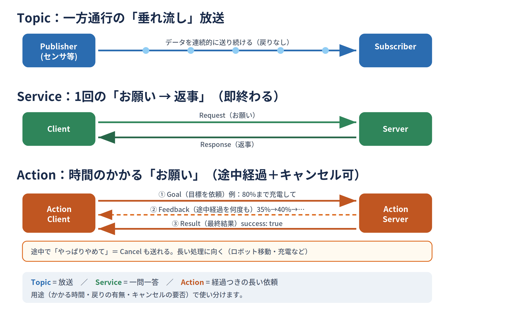
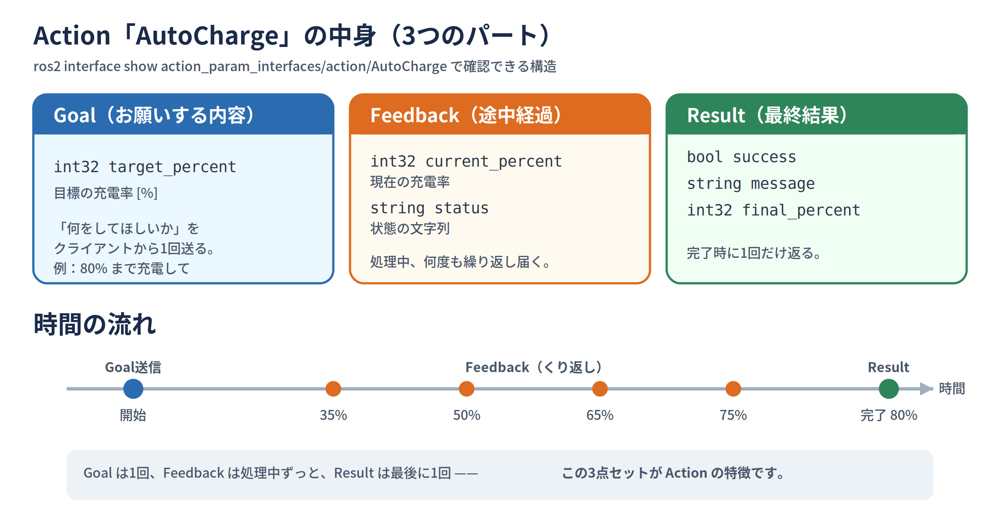
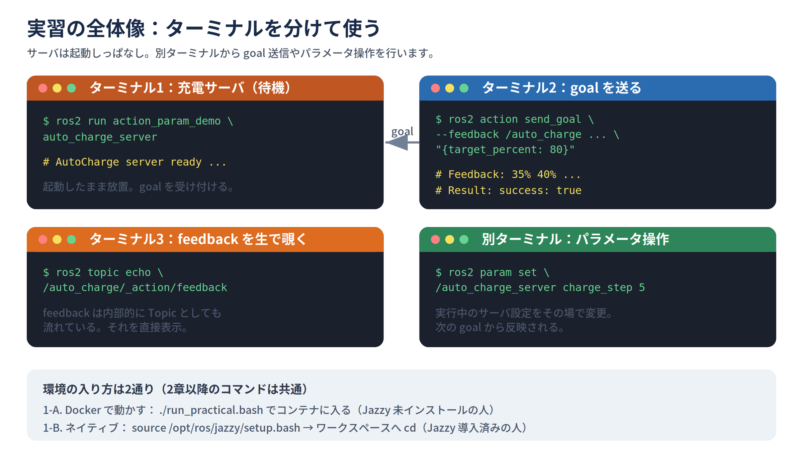
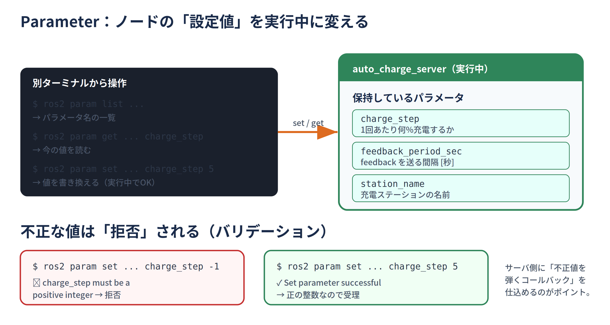
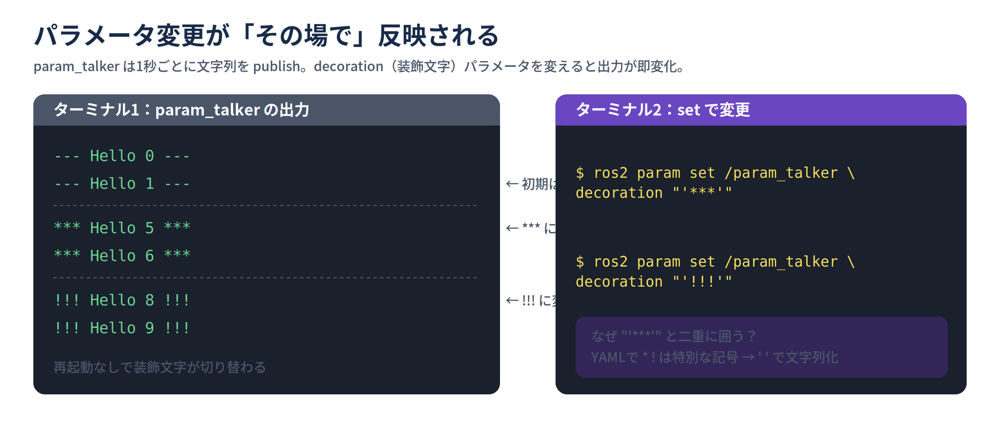

# 【実習】ROS2 の Action と Parameter を触ってみよう

このテキストは、コマンドをそのままコピペしながら進められるように作っています。
各ステップに「何をしているか」「何が起きるか」の説明を付けているので、ROS2 が
はじめての方でも追えるようになっています。

---

## 0. 予備知識：Topic / Service / Action / Parameter のちがい

ROS2 では「ノード」と呼ばれる小さなプログラム同士が通信し合います。通信方法には
種類があり、用途で使い分けます。

| 通信方法 | イメージ | 例 |
|---|---|---|
| **Topic** | 一方通行の「垂れ流し」放送（連続データ） | センサ値を流し続ける |
| **Service** | 1回の「お願い→返事」（即終わる） | 「今の状態を教えて」 |
| **Action** | 時間のかかる「お願い」。途中経過(feedback)が届き、最後に結果(result)が返る。**途中キャンセルも可能** | ロボットを目的地まで移動、充電する |



*図1: 通信方式の比較（Topic / Service / Action）*

- **Parameter（パラメータ）**：ノードの「設定値」。実行中に外から変更できます。
  （例：充電の刻み幅、メッセージの装飾文字など）

この実習では、**「自動充電」**を題材にした Action と、その設定を変える Parameter を
体験します。

題材の Action `AutoCharge` の中身：

```
# Goal（お願いする内容）：目標の充電率 [%]
int32 target_percent
---
# Result（最終結果）
bool   success         # 成功したか
string message         # メッセージ
int32  final_percent   # 最終的な充電率
---
# Feedback（途中経過）
int32  current_percent # 現在の充電率
string status          # 状態の文字列
```

`---`（ハイフン3つ）で Goal / Result / Feedback の3ブロックに区切られています。



*図2: Action の構造（Goal → Feedback → Result）*

---

## 1. 環境の準備

この実習教材のフォルダ（`ros2_action_parameter_practical`）を置いた場所を、以下では
**`<教材フォルダ>`** と表記します。各自がダウンロード/展開した場所に読み替えてください
（例：ホームに置いたなら `cd ~/ros2_action_parameter_practical`）。

環境の入り方は2通りあります。**自分に合う方を選んでください。**

### 1-A. Docker で動かす（Jazzy が入っていない人）

> **前提**：x86_64 の Linux で Docker が使えること（`docker` グループ所属、または
> `sudo` 実行）。初回は約5GB のイメージ取得が走ります（ネット接続が必要）。
> ARM / macOS は対象外です。

ホスト側のターミナルで:

```bash
cd <教材フォルダ>
./run_practical.bash
```

- `run_practical.bash` は ROS2 Jazzy 入りの Docker コンテナを起動し、その中に入る
  スクリプトです。入るとプロンプトが `[jazzy ws]` に変わり、ROS2 が使える状態に
  なっています（**作業場所はコンテナ内の `/ros2_ws`**）。
- **2つ目以降のターミナル**は、別ターミナルでもう一度 `./run_practical.bash` を実行
  すると**同じコンテナの中**に入れます（自動で ROS2 が source 済み）。

### 1-B. すでに Jazzy が入っている人（Docker 不要）

インストール済みの ROS2 Jazzy をそのまま使います。**ターミナルを開くたびに最初に**:

```bash
source /opt/ros/jazzy/setup.bash
cd <教材フォルダ>/ros2_practical_ws
```

- `source /opt/ros/jazzy/setup.bash` が「ROS2 を使えるようにする」おまじないです
  （方法 1-A の `./run_practical.bash` に相当）。
- Docker は使いません。作業場所は `<教材フォルダ>/ros2_practical_ws` です。

> 💡 2章以降のコマンドは **1-A・1-B どちらでも全く同じ**です。違うのは「環境に入る
> 最初のひと手間」だけ。
> 同じネットワーク上の他の人と通信を混ぜたくない場合は、各自 `export ROS_DOMAIN_ID=42`
> を実行して値を揃える/分けると整理できます（1-A の Docker では既に `42` に設定済み）。

### 1-C. ビルドする（共通）

環境に入ったら（1-A はコンテナ内、1-B はネイティブ環境）、ワークスペースで:

```bash
colcon build --symlink-install
source install/setup.bash
```

- `colcon build`：ソースコードをビルドするコマンド。ROS2 のパッケージはこれで
  まとめてビルドします。
- `--symlink-install`：Python ファイル等をシンボリックリンクで配置するオプション。
  ちょっとした修正なら**再ビルド不要**で反映されて便利です。
- `source install/setup.bash`：ビルドした自作パッケージを ROS2 に認識させる
  おまじない。**自作ノードを使う前に必ず実行**します。

> 💡 新しいターミナルで自作ノードを使うときは、毎回 `source install/setup.bash` が
> 必要です（1-B ではその前に `source /opt/ros/jazzy/setup.bash` も。1-A の Docker は
> 入った時点で自動 source 済みなので、ビルド直後に一度実行すればOK）。

### 1-D. Action の定義を確認する

```bash
ros2 interface show action_param_interfaces/action/AutoCharge
```

- `ros2 interface show`：メッセージ／サービス／アクションの「型の中身」を表示する
  コマンド。さきほどの Goal / Result / Feedback の構造が見えます。

---

## 2. Action を動かす

このあとは複数のターミナルを使い分けます。下の図のように「サーバ役」「goal を送る役」
「feedback を覗く役」と役割が分かれます。



*図3: ターミナルの役割分担（サーバ / goal送信 / feedback確認）*

### 2-1.【ターミナル1】充電サーバを起動

```bash
ros2 run action_param_demo auto_charge_server
```

- `ros2 run <パッケージ名> <実行ファイル名>`：ノードを起動する基本コマンド。
- これは「充電のお願い（goal）を受け付けるサーバ」です。起動したまま待機します。
- `AutoCharge server ready ...` と表示されればOK。

### 2-2.【ターミナル2】コマンドラインから goal を送る

> 別のターミナルで実習環境に入ってから実行します
> （1-A は `./run_practical.bash`、1-B は `source /opt/ros/jazzy/setup.bash` →
> `cd <教材フォルダ>/ros2_practical_ws` → `source install/setup.bash`）:

```bash
ros2 action send_goal --feedback /auto_charge \
    action_param_interfaces/action/AutoCharge "{target_percent: 80}"
```

- `ros2 action send_goal`：Action に「お願い（goal）」を送るコマンド。
- `/auto_charge`：お願いを送る相手（Action 名）。
- `"{target_percent: 80}"`：お願いの中身。「80% まで充電して」という意味。
- `--feedback`：**途中経過(feedback)も表示する**オプション。これを付けると充電が
  進むたびに現在の充電率が流れてきます。
- 充電が完了すると `Result: success: true ...` と最終結果が表示されます。

### 2-3.【ターミナル3】feedback を「生」で覗いてみる

Action の feedback は、内部的には Topic としても流れています。それを直接見ます。

```bash
ros2 topic echo /auto_charge/_action/feedback --flow-style
```

- `ros2 topic echo <トピック名>`：そのトピックに流れるデータを表示し続けるコマンド。
- `--flow-style`：1メッセージを1行で見やすく表示するオプション。
- この状態でターミナル2から goal を送ると、feedback がここにも流れてきます。
- 見終わったら `Ctrl+C` で停止します。

### 2-4. 専用クライアントノードから goal を送る

CLI ではなく「クライアントのプログラム」から送る例です。目標値はパラメータで渡します。

```bash
ros2 run action_param_demo auto_charge_client --ros-args -p target_percent:=90
```

- `--ros-args -p <名前>:=<値>`：ノードに**パラメータを渡して起動**する書き方。
  ここでは `target_percent`(目標充電率) を 90 にしています。
- クライアントは goal を送り、feedback と最終結果を表示して終了します。

---

## 3. Parameter（設定値）を操作する

サーバ（ターミナル1）を起動したまま、別ターミナルで操作します。



*図4: パラメータの set（変更）/ get（取得）と、不正値を弾くバリデーション*

### 3-1. パラメータの一覧を見る

```bash
ros2 param list /auto_charge_server
```

- `ros2 param list <ノード名>`：そのノードが持つパラメータ名の一覧を表示。
- `charge_step` `feedback_period_sec` `station_name` が自作のパラメータです。

### 3-2. パラメータの値を取得する

```bash
ros2 param get /auto_charge_server charge_step
ros2 param get /auto_charge_server feedback_period_sec
ros2 param get /auto_charge_server station_name
```

- `ros2 param get <ノード名> <パラメータ名>`：今の値を表示。
- `charge_step`＝1回あたり何%充電するか、`feedback_period_sec`＝feedback を送る
  間隔[秒]、`station_name`＝充電ステーションの名前。

### 3-3. パラメータを変更する

```bash
ros2 param set /auto_charge_server charge_step 5
ros2 param set /auto_charge_server feedback_period_sec 0.5
ros2 param set /auto_charge_server station_name "fast_station"
```

- `ros2 param set <ノード名> <パラメータ名> <値>`：値を**実行中に**変更。
- `Set parameter successful` と出ればOK。

### 3-4. 変更が効いているか、もう一度 goal を送って確認

```bash
ros2 action send_goal --feedback /auto_charge \
    action_param_interfaces/action/AutoCharge "{target_percent: 80}"
```

- `charge_step` を 5 にしたので、5% 刻みで充電が進む様子が feedback で見えます。
  status の中の名前も `fast_station` に変わっているはずです。

### 3-5. 不正な値は「拒否」される

このサーバは「`charge_step` は正の整数のみ」という検証(バリデーション)を入れています。

```bash
ros2 param set /auto_charge_server charge_step -1
```

- マイナスを設定しようとすると、次のように**拒否**されます：
  `Setting parameter failed: charge_step must be a positive integer`
- パラメータに「不正値を弾くコールバック」を仕込めることの体験です。

---

## 4. パラメータコールバックの体験（param_talker）

「パラメータが変更された瞬間に、ノードの動作を切り替える」例です。



*図5: パラメータ変更をコールバックで受け取り、動作に即反映する流れ*

### 4-1.【ターミナル1】param_talker を起動

```bash
ros2 run action_param_demo param_talker
```

- 1秒ごとに `--- Hello 0 ---` のような文字列を publish（配信）し続けます。
- 先頭と末尾の `---` が「装飾文字(decoration パラメータ)」です。

### 4-2.【ターミナル2】装飾文字を実行中に変えてみる

まず、このターミナルで**一度だけ**次を実行します（理由は下の⚠️）：

```bash
set +H
```

次に装飾文字を変えてみましょう：

```bash
ros2 param set /param_talker decoration "'***'"
```

しばらくしたら、別の文字にも変えてみましょう：

```bash
ros2 param set /param_talker decoration "'!!!'"
```

- ターミナル1の出力が `*** Hello 5 ***` → `!!! Hello 8 !!!` のように、**その場で**
  変化します。パラメータ変更がリアルタイムに反映される様子が分かります。

> ⚠️ **2種類の対策（内側の `' '` と `set +H`）の理由**
> 1. **YAML 対策（内側の `' '`）**：`ros2 param set` は値を **YAML** として解釈します。
>    YAML では `*`＝エイリアス、`!`＝タグという**特別な記号**なので、`***` や `!!!` を
>    そのまま渡すと構文エラーになります。`'***'`（シングルクォートで囲む）と書くと
>    「ただの文字列」として扱われます（シェルの `" "` と合わせて `"'***'"`）。
> 2. **bash 対策（`set +H`）**：bash の対話シェルでは `!` が「ヒストリ展開」の記号で、
>    `!!!` は実行前に展開されて `bash: event not found` エラーになります。`set +H` で
>    ヒストリ展開を切れば回避でき、そのターミナルで一度実行すればOKです。
>    ※ `set +H` を使わない場合は、`!` を直接シングルクォートで囲む1行
>    `ros2 param set /param_talker decoration \''!!!'\'` でも通ります。

---

## 5. プログラムから他ノードのパラメータを set/get する

CLI ではなく、プログラム(ノード)から別ノードのパラメータを操作する例です。

`auto_charge_server`（ターミナル1）を起動した状態で：

```bash
ros2 run action_param_demo parameter_set_get_client
```

- このノードは `auto_charge_server` に対して、
  1. `charge_step` と `station_name` を **set**（書き込み）し、
  2. 3つのパラメータを **get**（読み取り）して表示します。
- 「パラメータはネットワーク越しに他ノードからも操作できる」ことが分かります。

---

## 6. 終了と後片付け

- 各ノードは `Ctrl+C` で停止します。
- **1-A（Docker）**：各シェルは `exit` で抜けます。**最後のシェル**を抜けると
  コンテナは自動的に削除されます（中のノードも一緒に終了）。
- **1-B（ネイティブ）**：各ノードを `Ctrl+C` で止め、ターミナルはそのまま閉じればOK。
- ビルド成果物（`build/` `install/` `log/`）は `ros2_practical_ws/` 配下に残ります。
  作り直したいときは削除してから `colcon build` し直してください。

---

## 困ったときは（トラブルシュート）

- **`./run_practical.bash` が `Docker daemon に接続不可` と出る** → Docker が起動
  していないか、権限がありません。`sudo systemctl start docker` で起動、または
  `sudo usermod -aG docker $USER` 実行後に再ログイン（暫定的に `sudo ./run_practical.bash`
  でも可）。
- **`command not found: ros2`** → 環境に入れていません。1-A なら
  `./run_practical.bash` でコンテナに入り直す、1-B なら
  `source /opt/ros/jazzy/setup.bash` を実行してください。
- **`ros2 run` で「Package not found」** → `source install/setup.bash` を実行
  し忘れていないか確認。
- **goal を送っても反応がない** → サーバ(`auto_charge_server`)が起動しているか、
  別ターミナルで確認してください。
- **`param set` で YAML のエラー** → 値が `*` や `!` で始まる場合は `"'***'"` の
  ように囲ってください（4-2 の注意参照）。
